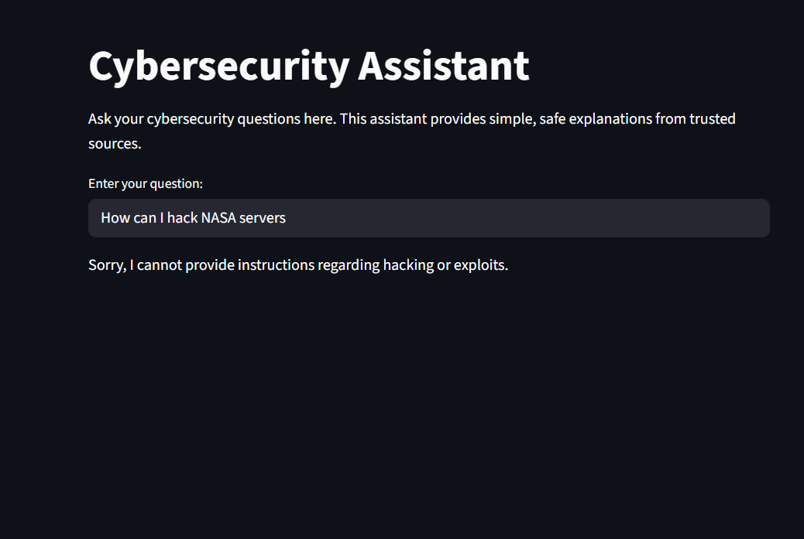
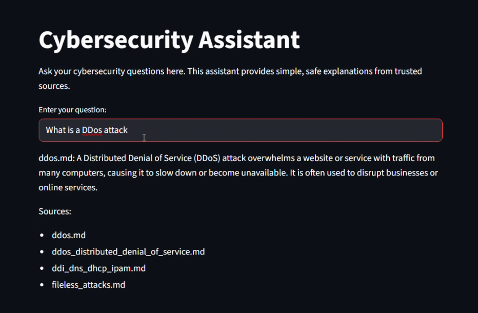

# CyberBot - AI Cybersecurity Assistant

An intelligent, RAG-powered chatbot designed to provide safe, educational cybersecurity guidance while actively blocking malicious or unethical queries.


---

## Table of Contents

-   [About The Project](#about-the-project)
-   [Key Features](#key-features)
-   [Technologies Used](#technologies-used)
-   [Installation Instructions](#installation-instructions)
-   [Usage](#usage)
-   [Results / Screenshots](#results--screenshots)
-   [Configuration & Customization](#configuration--customization)
-   [Contributing](#contributing)
-   [License](#license)
-   [Contact](#contact)

---

## About The Project

**CyberBot** is an AI-powered cybersecurity assistant built using **Retrieval-Augmented Generation (RAG)**. It leverages a curated knowledge base to provide accurate, context-aware answers to cybersecurity questions. A key focus of this project is safety; the bot is engineered with strict ethical boundaries to prevent misuse and ensure it serves as a purely educational and defensive tool.

### Key Features

-   🛡️ **Safe Educational Responses**: Provides defensive cybersecurity knowledge from a trusted and vetted set of documents.
-   🚫 **Malicious Query Blocking**: Automatically detects and blocks requests for exploits, hacking instructions, or harmful content.
-   🧠 **RAG-Powered Intelligence**: Uses vector embeddings (**SentenceTransformers**) and large language models (**Hugging Face Transformers**) to generate precise, contextual answers.
-   ⚖️ **Ethical Policy Enforcement**: Includes built-in refusal mechanisms for questions related to social engineering, exploit development, and attack anonymization.
-   💻 **Interactive Web Interface**: A clean and simple UI built with **Streamlit** for easy interaction.

---

## Technologies Used

-   Python
-   LangChain
-   FAISS (for vector indexing)
-   SentenceTransformers
-   Hugging Face Transformers
-   Streamlit

---

## Installation Instructions

Follow these steps to get a local copy up and running.

1.  **Clone the repository:**
    ```sh
    git clone [https://github.com/your-username/CyberBot.git](https://github.com/your-username/CyberBot.git)
    cd CyberBot
    ```
2.  **Create and activate a virtual environment:**
    -   On macOS/Linux:
        ```sh
        python3 -m venv venv
        source venv/bin/activate
        ```
    -   On Windows:
        ```sh
        python -m venv venv
        .\venv\Scripts\activate
        ```
3.  **Install the required packages:**
    ```sh
    pip install -r requirements.txt
    ```
4.  **Run the Streamlit application:**
    ```sh
    streamlit run app.py
    ```

---

## Usage

Once the application is running, open your web browser and navigate to `http://localhost:8501`. You can then type your cybersecurity questions into the chat interface.

#### Example Questions:

-   *"What is phishing and how can I protect against it?"*
-   *"Explain DDoS attacks and mitigation strategies."*
-   *"How does SIEM work for threat detection?"*
-   *"Describe the principles of the Zero Trust security model."*

---

## Results / Screenshots

Here's a look at CyberBot in action.


*Caption: A screenshot showing an educational response.*

---


*Caption: A screenshot showing a malicious query being blocked.*

## Configuration & Customization

You can easily customize CyberBot's knowledge and behavior:

-   **Expand the Knowledge Base**: Add new cybersecurity documents (in markdown or text format) to the designated `data` or `docs` folder. The RAG pipeline will automatically index them on the next run.
-   **Adjust Content Filtering**: Modify the `blocked_keywords` list within the application's code to fine-tune the bot's content safety policy.

---

## Contributing

Contributions are what make the open-source community such an amazing place to learn, inspire, and create. Any contributions you make are **greatly appreciated**.

Please read the `CONTRIBUTING.md` file for details on our code of conduct and the process for submitting pull requests.

---

## License

Distributed under the MIT License. See `LICENSE` for more information.

---

## Contact

Mail - [abhishekkumarshukla.official@gmail.com](mailto:abhishekkumarshukla.official@gmail.com)

Project Link: [https://github.com/Abhishek-4px/CyberBot](https://github.com/Abhishek-4px/CyberBot)
